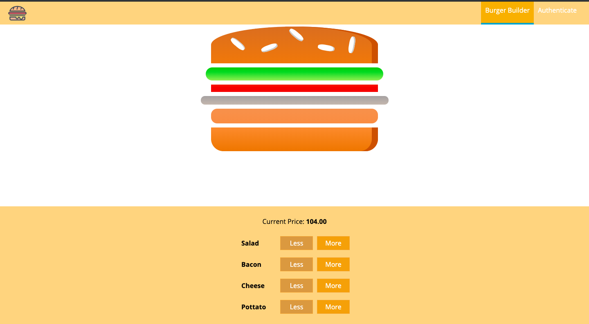
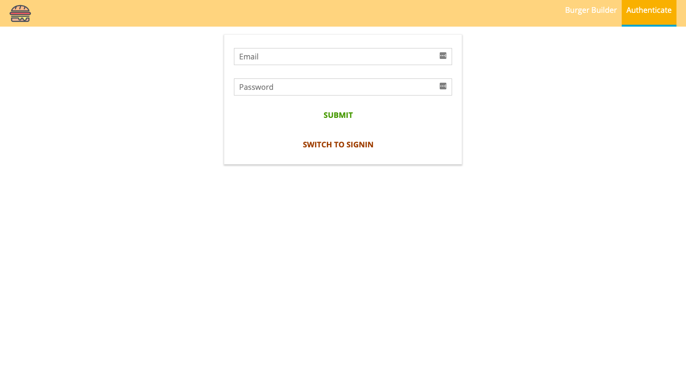
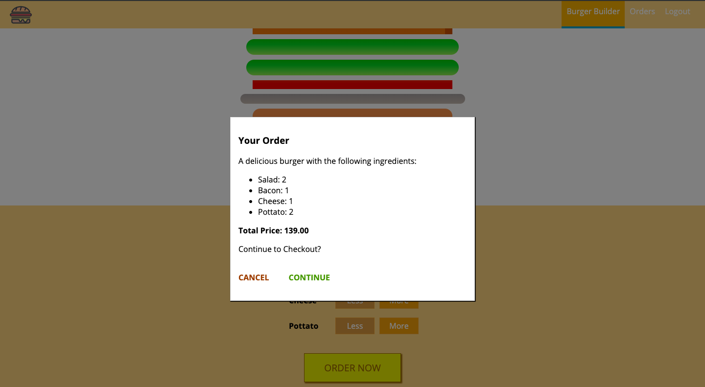
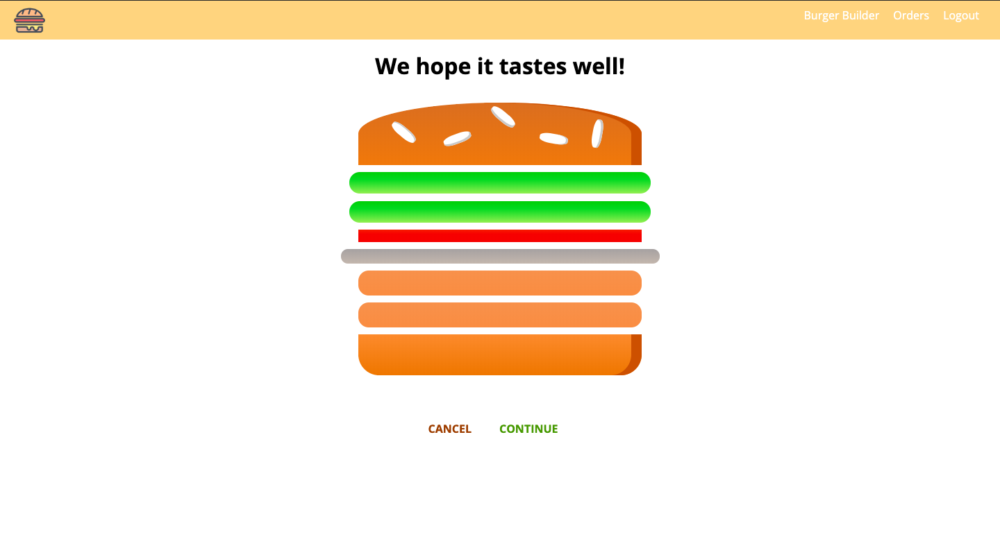
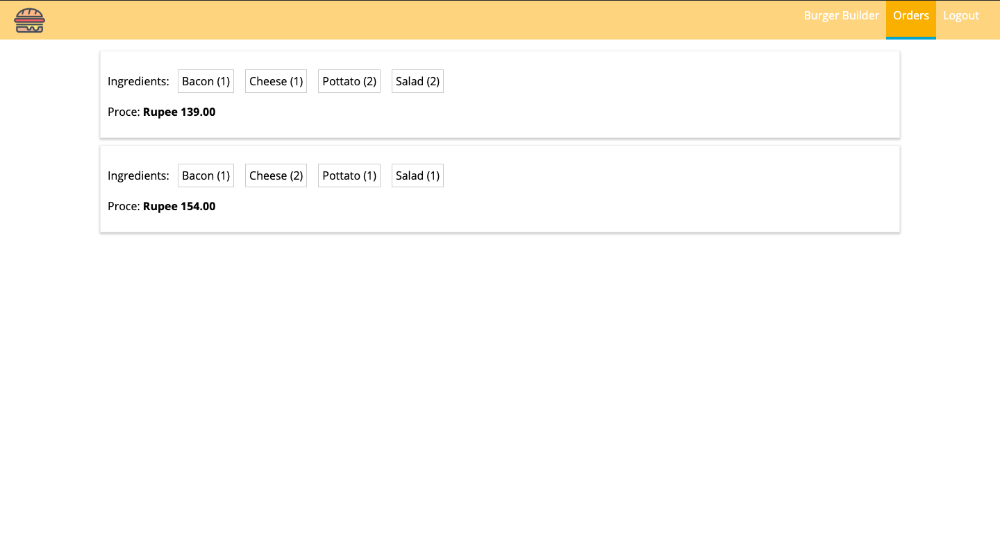

# Burger Store

This project is build with ReactJS.

## Project Overview

Burger store allows the user to build a burger with customized ingredients. It also has a login/signup option so The authenticated users can save their orders and repeat the saved orders.

### [Live Demo](https://react-burger-store-24abd.firebaseapp.com/)

<p>
  
---
  
---
  
---
  
---
  
</p>

## Instructions

1 Clone this repository

```
$ git clone <Url>
```

2 Browse to root folder of this repository

3 Open terminal and run

```
$ npm start
```

4 Open browser and goto

```
 http://localhost:3000/
 ```

 5 That's it